  <h2> Hello World! </h2>
   <h3> I'm Abhishek Keshri aka <a href="https://2kabhishek.github.io" target="_blank">2KAbhishek </a> </h3>
   
 <b>  Software Craftsperson 💼 | Learner 📚 | Maker 👨🏻‍💻 | Explorer 🔎 </b> 

   
 I code to make lives easier, to learn and for fun! 

   <a href="https://2kabhishek.github.io/links" target="_blank">Find Me </a>

     

  
 If you like my work, hit <b>✨ Follow ✨</b> for updates 

  
 <b> 🔥 Keep making noises with your keyboard! 🔥 </b>

  
  

    
<i> 🪄 Click here for a Magic trick! 🪄 </i>

     
      Aha! I tricked you into clicking 😋
      
      Now can you hit the <b>✨ Follow ✨</b> button too please 🫣
  

